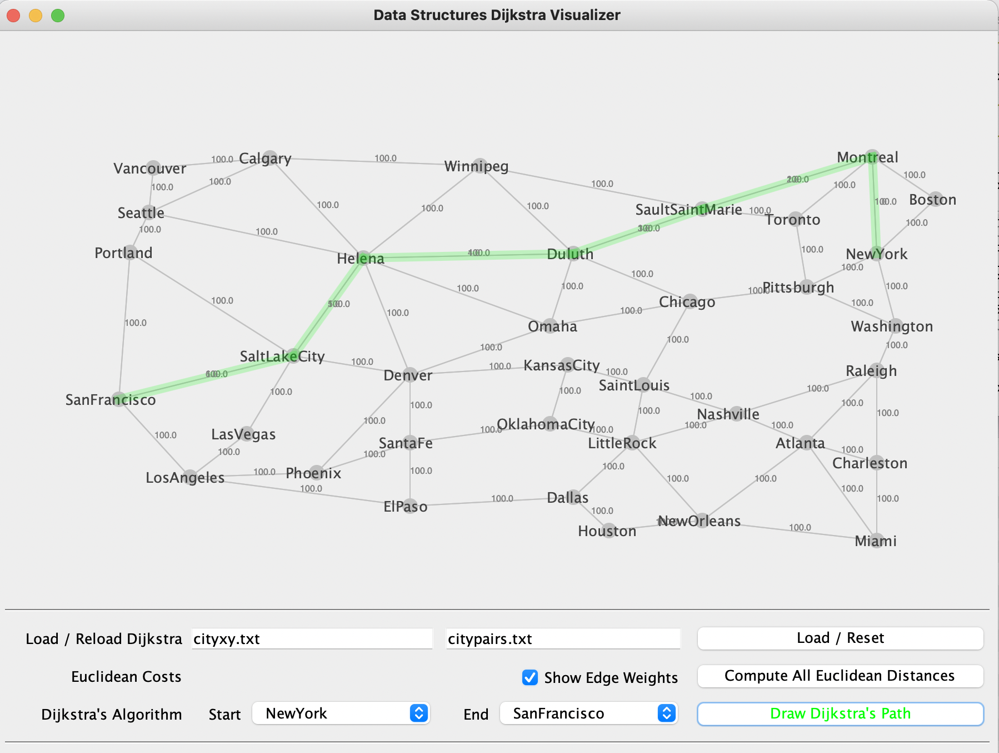

<h1>Shortest Path Between Cities</h1>

**What does the program do?**

In this project, we implement Dijkstra's algorithm to find shortest paths between pairs of cities on a map. It includes a GUI that lets you visualize the map and the path your algorithm finds between two cities.

**How do I compile and run the program?**

> Type <code> bash rundisplay </code>

If  you would like to just compile and run the program individually:

> Compile all the programs by typing-  <code>javac *.java</code>. 

> Then run Display GUI- <code>java Display</code> 

**What's the output?**

Running the program should bring up a view of the computer's actual desktop screen. Inside, a window will have appeared with your running program that displays the map.

You can specify the start and end location. Click "Draw Dijkstra's Path," and the program will show you the path. 

 **The directory includes:** 

| List of Files | Description                                                                                                                                                                                  |
|---------------|----------------------------------------------------------------------------------------------------------------------------------------------------------------------------------------------|
| <code>cityxy.txt</code>   | a list of cities and their (X,Y) coordinates on the map. These are the vertices in the graph.                                                                                                |
| <code>citypairs.txt</code> | lists direct, connections between pairs of cities. These links are bidirectional, if you can go from NewYork to Boston, you can go from Boston to NewYork. These are the edges of the graph. |
| <code>Vertex.java</code>  | represent the vertices                                                                                                                                                                       |
| <code>Edge.java</code>     | represent the edges                                                                                                                                                                          |
| <code>Dijkstra.java</code>| represents a graph and contains implementation of Dijkstra's algorithm                                                                                                                       |
| <code>Display.java</code> | the Display GUI                                                                                                                             

